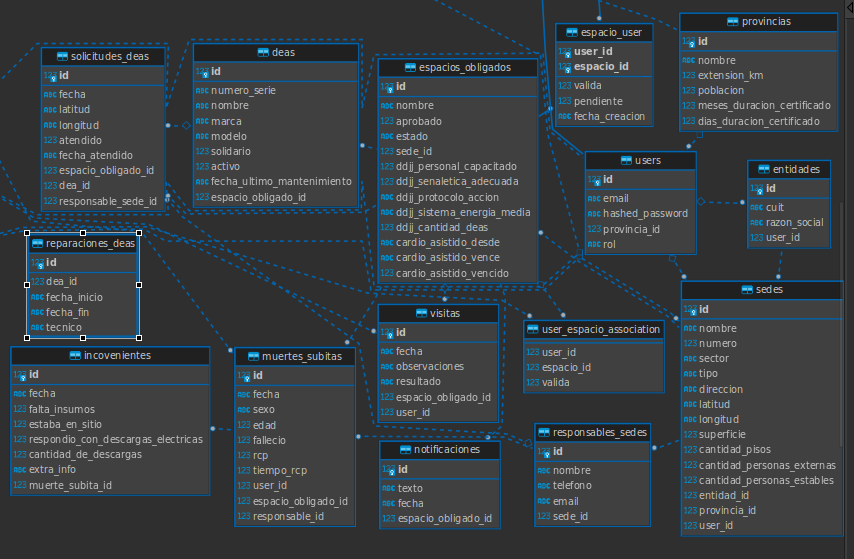

# TTPS


## Pre-requisitos

- Python 3.10.12
- SQLite.

## Instalación

### 1. Clonar el Repositorio

```bash
git clone [URL_DEL_REPOSITORIO]
cd [NOMBRE_DEL_DIRECTORIO]


### 2. Crear un Entorno Virtual (Opcional, pero recomendado)
python -m venv venv
source venv/bin/activate  # En Windows: .\venv\Scripts\activate

### 3. Instalar las Dependencias
pip install -r requirements.txt

### Iniciar Alembic
alembic init alembic

#Configuración de la Base de Datos
###1. Configurar la Conexión a la Base de Datos
###2. Crear la Base de Datos
python main.py
###3. Ejecutar Migraciones
alembic upgrade head
### En caso de modificar un modelo y  tener que crear una migracion:
alembic revision --autogenerate -m "Descripción de la migración"
### Tener cuidado con alembic porque puede fallar la migracion automatica, siempre validar antes de mergear

## Correr la Aplicación

### 1. Iniciar el Servidor FastAPI
uvicorn main:app --reload

Ahora, puedes visitar `http://127.0.0.1:8000` en tu navegador para acceder a la aplicación.

## Documentación
http://127.0.0.1:8000/docs